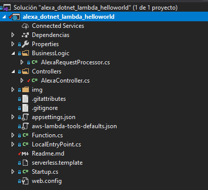
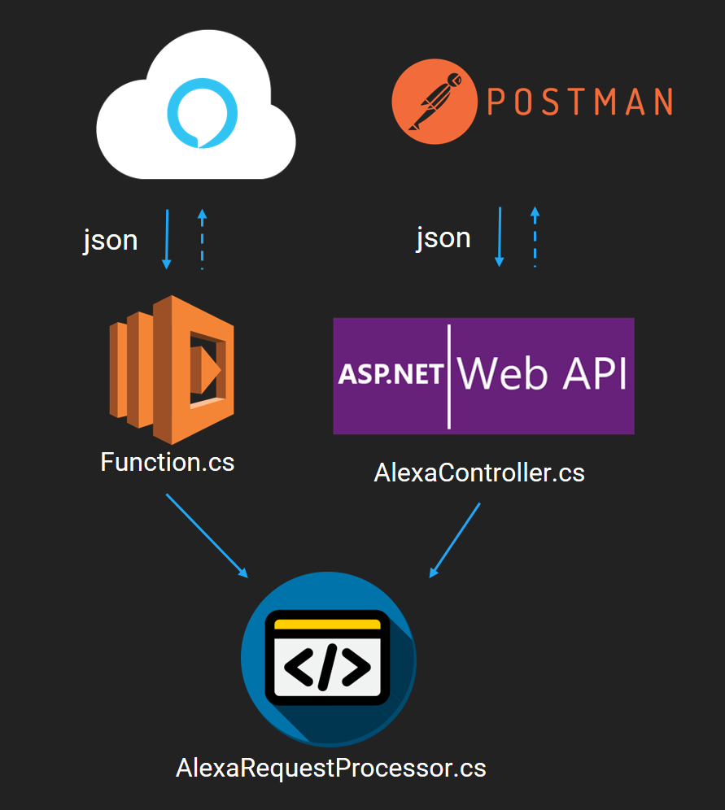
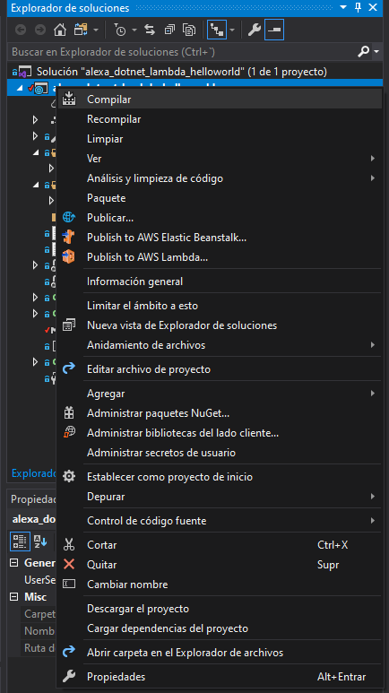
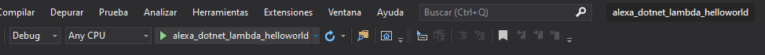
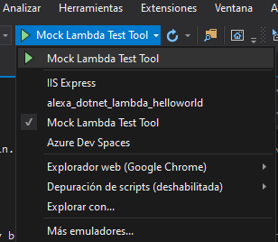
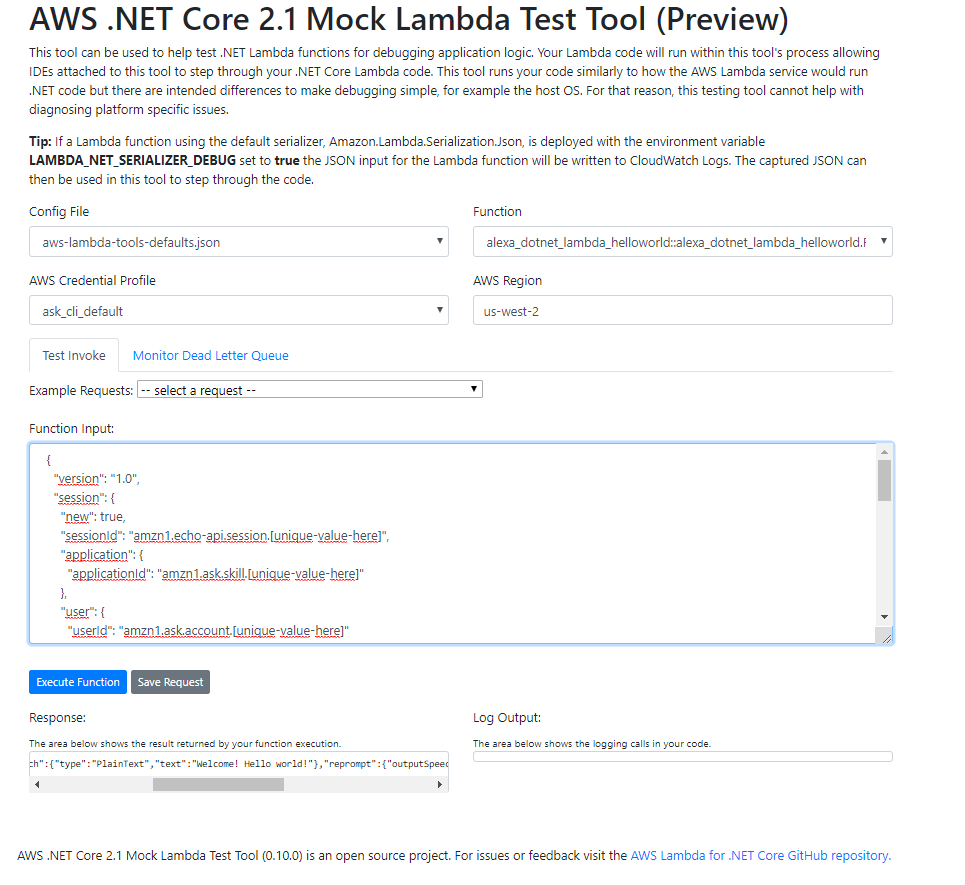
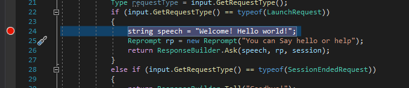
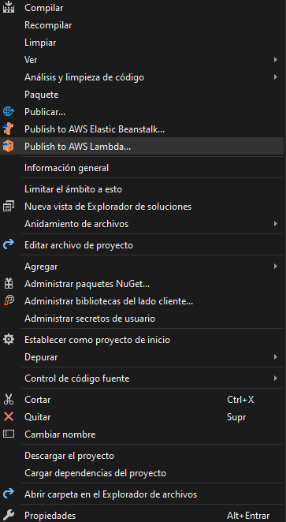
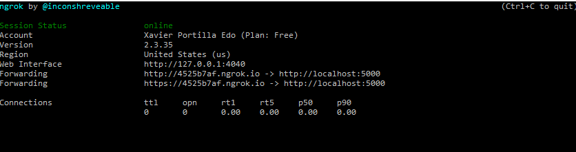

# Alexa Skill with .NET Core

Alexa skills can be developed using Alexa Lambda functions or a REST API endpoint. 
Lambda function is Amazon's implementation of serverless functions available in AWS. 
Amazon recommends using Lambda functions despite they are not easy to debug. 
While you can log to a CloudWatch log, you can't hit a breakpoint and step into the code. 
 
This makes live debugging of Alexa requests a very hard task.
This post explains a simple but useful solution: it is to wrap code in a .NET Standard class library and stand up a REST API project for debugging and development and a Lambda function project for AWS deployment. 
This article shows how to create an environment to debug a locally-hosted Web API that uses the same logic that is used by a Lambda function and everything written in C#.

## Structuring the Solution
 
This approach requires a minimum of two projects in the solution:
1. Lambda function project (.NET Core 2.1)
2. Web API project (.NET Core 2.1)

### Prerequisites

Here you have the technologies used in this project
1. .NET Core 2.1
2. Visual Studio Community 2019
3. Nugget Package Manager
4. Alexa .NET (Version 1.13.0)
5. ngrok

The [AWS Toolkit for Visual Studio](https://aws.amazon.com/visualstudio/) includes Lambda function projects and can be used to create .NET Core Lambda functions. 
All meaningful logic should be contained in the `BusinessLogic` folder and referenced by both the Lambda function project and the Web API project. 

Install Amazon.Lambda.Tools Global Tools if not already installed.
```
    dotnet tool install -g Amazon.Lambda.Tools
```

If already installed check if new version is available.
```
    dotnet tool update -g Amazon.Lambda.Tools
```

### Project Files 

These are the main files of the project:



* serverless.template - an AWS CloudFormation Serverless Application Model template file for declaring your Serverless functions and other AWS resources
* aws-lambda-tools-defaults.json - default argument settings for use with Visual Studio and command line deployment tools for AWS
* Function.cs - class that derives from **Amazon.Lambda.AspNetCoreServer.APIGatewayProxyFunction**. The code in 
this file bootstraps the ASP.NET Core hosting framework. The Lambda function is defined in the base class.
* LocalEntryPoint.cs - for local development this contains the executable Main function which bootstraps the ASP.NET Core hosting framework with Kestrel, as for typical ASP.NET Core applications.
* Startup.cs - usual ASP.NET Core Startup class used to configure the services ASP.NET Core will use.
* web.config - used for local development.
* Controllers\AlexaController.cs - Alexa API controller that will receive all the requests from the cloud. This controller allow us to debug our skill locally.
* BsuinessLogic\AlexaProcessor.cs - The code that will process all the Alexa requests from the Lambda Function in Function.cs and from POST controller in AlexaController.cs

Once the structure has been explained, it is time to understand how it works the entire project:




### Alexa Request Processor 

Alexa.NET is a helper library for working with Alexa skill requests/responses in C#. 
Whether you are using the AWS Lambda service or hosting your own service on your server, this library aims just to make working with the Alexa API more natural for a C# developer using a strongly-typed object model.

You can find all the documentation in their official [GitHub repository](https://github.com/timheuer/alexa-skills-dotnet)

Below you have the class that will manage all the Alexa requests using Alexa.NET Nugget package showing up how easy is to develop these kind of voice apps in .NET:

```csharp
    public class AlexaRequestProcessor
    {
        public SkillResponse Process(SkillRequest input)
        {

            Session session = input.Session;
            if (session.Attributes == null)
                session.Attributes = new Dictionary<string, object>();

            Type requestType = input.GetRequestType();
            if (input.GetRequestType() == typeof(LaunchRequest))
            {
                string speech = "Welcome! Hello world!";
                Reprompt rp = new Reprompt("You can Say hello or help");
                return ResponseBuilder.Ask(speech, rp, session);
            }
            else if (input.GetRequestType() == typeof(SessionEndedRequest))
            {
                return ResponseBuilder.Tell("Goodbye!");
            }
            else if (input.GetRequestType() == typeof(IntentRequest))
            {
                var intentRequest = (IntentRequest)input.Request;
                switch (intentRequest.Intent.Name)
                {
                    case "AMAZON.CancelIntent":
                    case "AMAZON.StopIntent":
                        return ResponseBuilder.Tell("Goodbye!");
                    case "AMAZON.HelpIntent":
                        {
                            Reprompt rp = new Reprompt("What's next?");
                            return ResponseBuilder.Ask("Here's some help. What's next?", rp, session);
                        }
                    case "HelloWorldIntent":
                        {
                            string helloWorld = "HelloWorld";
                            Reprompt rp = new Reprompt(helloWorld);
                            return ResponseBuilder.Ask(helloWorld, rp, session);
                        }
                    default:
                        {
                            string speech = "I didn't understand - try again?";
                            Reprompt rp = new Reprompt(speech);
                            return ResponseBuilder.Ask(speech, rp, session);
                        }
                }
            }
            return ResponseBuilder.Tell("Goodbye!");
        }
    }

```


## Build the Skill with Visual Studio

Visual Studio offers a lot of built-in functionality. If you want to build the whole solution within the IDE you can do it interactively:



## Run the Skill with Visual Studio

Run the Alexa Skill is as easy as click on the play button in Visual Studio. Using the configuration `alexa_dotnet_lambda_helloworld`:



After executing it, you can send Alexa POST requests to http://localhost:5000/api/alexa.

This execution will run the web API project. If you want to run the Lambda function you have to run the configuration `Mock Lambda Test Tool`:



This execution will run a browser with the Mock Lambda Test Tool and you can execute there all requests directly towards your Function.cs:



## Debug the Skill with Visual Studio

Following the steps before, now you can set up breakpoints wherever you want inside all C# files in order to debug your skill:



## Test requests locally

I'm sure you already know the famous tool call [Postman](https://www.postman.com/). REST APIs have become the new standard in providing a public and secure interface for your service. Though REST has become ubiquitous, it's not always easy to test. Postman, makes it easier to test and manage HTTP REST APIs. Postman gives us multiple features to import, test and share APIs, which will help you and your team be more productive in the long run.

After run your application you will have an endpoint available at http://localhost:5000/api/alexa. With Postman you can emulate any Alexa Request. 

For example, you can test a `LaunchRequest`:

```json
  {
    "version": "1.0",
    "session": {
      "new": true,
      "sessionId": "amzn1.echo-api.session.[unique-value-here]",
      "application": {
        "applicationId": "amzn1.ask.skill.[unique-value-here]"
      },
      "user": {
        "userId": "amzn1.ask.account.[unique-value-here]"
      },
      "attributes": {}
    },
    "context": {
      "AudioPlayer": {
        "playerActivity": "IDLE"
      },
      "System": {
        "application": {
          "applicationId": "amzn1.ask.skill.[unique-value-here]"
        },
        "user": {
          "userId": "amzn1.ask.account.[unique-value-here]"
        },
        "device": {
          "supportedInterfaces": {
            "AudioPlayer": {}
          }
        }
      }
    },
    "request": {
      "type": "LaunchRequest",
      "requestId": "amzn1.echo-api.request.[unique-value-here]",
      "timestamp": "2020-03-22T17:24:44Z",
      "locale": "en-US"
    }
  }
```

You can execute unit tests as well
```
    cd "alexa_dotnet_lambda_helloworld/test/alexa_dotnet_lambda_helloworld.Tests"
    dotnet test
```

## Deploy your Alexa Skill

You can do it directly from Visual Studio or from your CLI:

### Here are some steps to follow from Visual Studio:

To deploy your Serverless application, right click the project in Solution Explorer and select *Publish to AWS Lambda*.

To view your deployed application, open the Stack View window by double-clicking the stack name shown beneath the AWS CloudFormation node in the AWS Explorer tree. The Stack View also displays the root URL to your published application.



### Here are some steps to follow to get started from the command line:

Once you have edited your template and code you can deploy your application using the [Amazon.Lambda.Tools Global Tool](https://github.com/aws/aws-extensions-for-dotnet-cli#aws-lambda-amazonlambdatools) from the command line.

Deploy application
```
    cd "alexa_dotnet_lambda_helloworld/src/alexa_dotnet_lambda_helloworld"
    dotnet lambda deploy-serverless
```
## Test requests directly from Alexa

ngrok is a very cool, lightweight tool that creates a secure tunnel on your local machine along with a public URL you can use for browsing your local site or APIs.

When ngrok is running, it listens on the same port that you’re local web server is running on and proxies external requests to your local machine

From there, it’s a simple step to get it to listen to your web server. Say you’re running your local web server on port 5000. In terminal, you’d type in: `ngrok http 5000`. This starts ngrok listening on port 5000 and creates the secure tunnel:



So now you have to go to [Alexa Developer console](https://developer.amazon.com/alexa/console/ask), go to your skill > endpoints > https, add the https url generated above followed by /api/alexa. Eg: https://fe8ee91c.ngrok.io/api/alexa.

Select the My development endpoint is a sub-domain.... option from the dropdown and click save endpoint at the top of the page.

Go to Test tab in the Alexa Developer Console and launch your skill.

The Alexa Developer Console will send a HTTPS request to the ngrok endpoint (https://fe8ee91c.ngrok.io/api/alexa) which will route it to your skill running on Web API server at http://localhost:5000/api/alexa.

## Conclusion 

This example can be useful for all those developers who do not want to write their code in Java, NodeJS or Pyhton. 
These are the official languages supported by Alexa.
We have to take into account that Alexa.NET nugget package is not an Official Alexa Skill Kit (ASK). 
This implies that you can find bugs or functionality that is not available despite it is in constantly changing.
I recommend you to access its official [GitHub repository](https://github.com/timheuer/alexa-skills-dotnet) to check the status of the project, bugs, updates, etc.
As you have seen in this example, the community of Alexa developers gives you the possibility to create skills in different ways. 
I hope this example project is useful to you.

That's all folks!

Happy coding!
